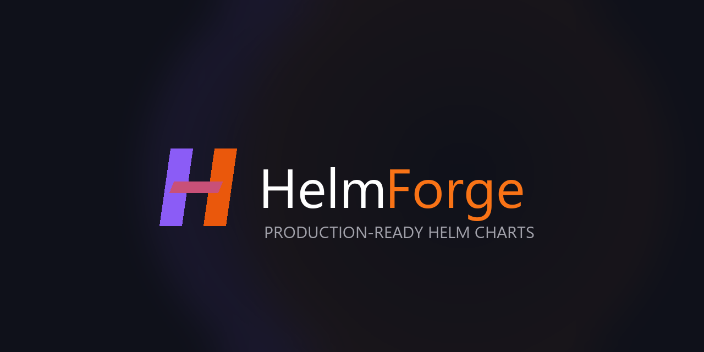

# HelmForge

Production-ready, truly open-source Helm charts for Kubernetes.

## Why HelmForge

- **Official upstream images** — every chart uses the image published by the application maintainers. No custom rebuilds, no proprietary layers.
- **MIT licensed, forever** — charts, CI, docs — everything is MIT. No open-core, no paid tiers, no license changes.
- **No abandoned open-source path** — other ecosystems moved their free images to legacy repositories that are no longer updated. HelmForge points to official upstream images maintained by the application authors.
- **Pinned version tags** — explicit, immutable image tags. No `:latest`, no floating tags.
- **Cosign signed** — every OCI artifact is signed with Sigstore Cosign keyless signing.
- **Built-in S3 backup** — 17+ charts include automated backup to any S3-compatible endpoint.
- **No vendor lock-in** — standard Helm, standard Kubernetes APIs, standard images.

## Install

```bash
helm repo add helmforge https://repo.helmforge.dev
helm repo update
helm install my-release helmforge/<chart-name>
```

Or via OCI:

```bash
helm install my-release oci://ghcr.io/helmforgedev/helm/<chart-name>
```

## Repositories

| Repository | Description |
|------------|-------------|
| [charts](https://github.com/helmforgedev/charts) | Source for all 33 Helm charts |
| [site](https://github.com/helmforgedev/site) | Documentation website ([helmforge.dev](https://helmforge.dev)) |

## Links

- **Website**: https://helmforge.dev
- **Charts catalog**: https://helmforge.dev/charts
- **Documentation**: https://helmforge.dev/docs
- **Comparison**: https://helmforge.dev/docs/comparison
- **Artifact Hub**: https://artifacthub.io/packages/search?repo=helmforge

## Contributing

Contributions are welcome in the [charts repository](https://github.com/helmforgedev/charts). Please follow the [contributing guide](https://github.com/helmforgedev/charts/blob/main/CONTRIBUTING.md).
